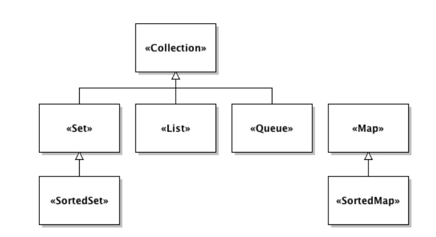

# Lecture 6

## Object interface - Definition

- The methodsignature of a class describe how objects can communicate with it
- To interact with an object, one must have a reference to the object andknow its interface.
- Knowing the interface of an object means knowing the signatures of its methods and, of course, the associated documentation.
- In Java, it is possible to materialize the interface of an object using interface declarations.
- Do not confuse programming interfaces, the subject of this course, with graphical interfaces (GUIs).

### Example
```java
public interface Canvas {
    String getName ();
    int getWidth ();
    int getHeight ();
    Collection <Figure > getFigures ();
}
```

## implement an interface
```java
public class BasicCanvas implements Canvas {
    private final int width ;
    private final int height ;
    private final String name ;
    private final ArrayList <Figure > figures ;

    public BasicCanvas ( final int width, final int height, final String name ) {
        this . width = width ;
        this . height = height ;
        this . name = name ;
        figures = new ArrayList < >();
    } 
    
    @Override
    public int getWidth() {
        return width;
    } 
    
    @Override
    public int getHeight() {
        return heigth;
    } 
    
    @Override
    public Collection<Figure> getFigures() {
        return figures;
    }

    @Override
    public String getName() {
        return name;
    }
}

```

### Name collision

You should avoid to have the same name for the interace and its implmentation. Moreover, if they are in the same package it is impossible to have the same name.

## Purpose

- During the software design phase
- Specification for the methods
- Acts as a contract
- Type for a variable
- Shared properties
- Classes need to share the same constants

### Example

the `List` interace has two implementation :
- `ArrayList` : storing elements in an array
- `LinkedList` : storing elements in a linked list

## Composition (via inheritance) of interfaces

An interface can be composed of other interface by inheritance to improve the scability

### Example

```java
public interface Human extends 
    Whistling , Walking {
}
```

### Name conflicts

Name conflicts can occur if two methods have the same name :

- If the signatures are the same : No problem
- If parameters are diffrent : Implement both methods
- If return types are different : Not allowed

## Constants

### Example
```java
public interface MathConstants {
    double PI = 3.1416;
}
```

### Use case

- In any class, you can access this constant by `MathConstants.PI`
- In any class that implements the `MathConstants` interface, you can directly access this constant (by simply writing `PI` )

## `Collections`

Java provides various implementations for object collections such as `Array List` and `LinkedList`

- `ArrayList` Allows to to access an element at index $n$ is bounded by a constant that does not depend on $n$, insertion or removal of elements is expensive.


- `LinkedList`, The access to elements is no longer in constant time. The access time to the element at index n$$ is bounded by an affine function of *n* such as $f(x) = (ax + b)$. Insertion or removal of elements is inexpensive

### Sorting algorithm

To indicate to a sorting algorithm `collection`'s methods if the access if random or static, Java introduces an empty interface (declaring no methods) named `RandomAccess`.

The algorithm can now know the type of access :

```java
if (collection instanceof RandomAccess) { /* ... */ }
else { /* ... */ }
```

### Definition
- A collection is a data structure that groups a variable number of objects into a single object.
- In Java a class are represented by a class, they can also be implemented by interfaces
- Collections are also represented by a set of algorithms that allow us to
manipulate them

### JDK Collections



#### `Collection`

It the root of the tree : it contains what is common to all collections

#### `Set`
Represents a finite set of objects, it cannot contain the same element twice. The order of objects is not guaranteed: Objects will not necessarily be retrieved in the same order as they were inserted

#### `SortedSet`
Represents a finite set of ordered objects, it cannot contain the same element twice, the order of object is not guaranteed.

#### `Map`
The Map interface represents a key – value association table

#### Implementation example
- `Hashtable` : Access to elements is synchronized, which allows handling concurrent data access. However, synchronization introduces an execution time overhead.

- `HashMap` : Access to elements is not synchronized, which does not allow parallelism. However, there is no execution time overhead.


#### `SortedMap`
interface represents a key – value association table with an order on the keys

## Programming to the interface
TO avoid to edit all declaration of `List` for example a good pratice is to use interfaces. 

To this end, we will instead use the List interface to declare our attributes, local variables, method parameters, etc.

Thus, if we need to change the implementation of the list, we will only need to modify the code where the list is instantiated.

```java
public class Factory extends Component {
    private final List<Component > components ;

    public Factory () {
        components = new ArrayList<Component >();
    }

    public List<Component > getComponents () {
        return components ;
    }
    // ...
}
```

### Why ?
- Significantly improves code maintainability by abstracting
the implementation that will be used at runtime.

- The interface only exposes the common methods of the implementing classes, preventing the programmer from using implementation-specific methods that would make the code harder to maintain when the implementation changes.

- Some applications may even choose to change the implementation at runtime

## Iterable Collection
If myCollection is a collection of Data objects, and the collection’s class implements the Iterable interface, you can iterate over this collection using the enhanced for loop

```java
Collection <Data > myCollection = new ArrayList < >();

for ( Data myData : myCollection ) {
    myData . doSomething ();
    // ...
}
```

All JDK collections also support the creation of iterators that can be used to traverse them.