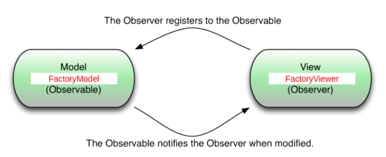
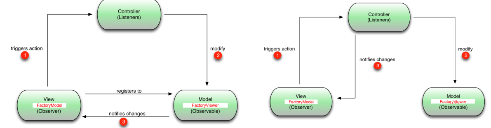

# Lecture 7

## Architecture

### La Vue

La vue permet à l'utilisateur d'interagir avec le logiciel. Elle est souvent composée de fenêtres.

### Le Modèle

- Le modèle est l'endroit où résident les données. Il est constitué d'un ou plusieurs objets et représente la **couche de logique métier**.
- Il doit contenir tout ce qui est nécessaire pour déterminer l'**état** de l'interface utilisateur et les **données** affichées.

### Le Contrôleur

- Le contrôleur fait le lien entre la vue et le modèle lorsqu'une action utilisateur se produit sur la vue.
- Cet objet est responsable du contrôle des données dans le modèle.

## Le Pattern Observateur-Observable

### Schéma



Toute modification du modèle doit être reflétée dans la vue.

### Interfaces

*Exemple uniquement, `@Deprecated`*

```java
public interface Observer {
    void modelChanged();
}
```

```java
public interface Observable {
    boolean addObserver(Observer observer);
    boolean removeObserver(Observer observer);
}
```

### Fonctionnement

- Toute méthode modifiant le modèle (par exemple, les setters) a été modifiée pour notifier les observateurs (vues) afin qu'ils puissent se rafraîchir.
- L'observateur (la vue-fenêtre `FactoryViewer`) propage le message de rafraîchissement de manière hiérarchique à tous ses composants (widgets) nécessitant une mise à jour.
- Le mécanisme est **automatisé**.

### Contrôleur



Le **pattern observateur-observable direct** est préféré car il permet d'avoir plusieurs vues sur les mêmes données.

---

### Points à vérifier :

1. **Images** : Assurez-vous que les images `observer-observable_pattern.png` et `controller.png` sont correctement intégrées et visibles.
2. **Exemples Concrets** : Si possible, ajoutez des exemples concrets pour illustrer l'utilisation du pattern Observateur-Observable dans une application réelle.
3. **Automatisation** : Expliquez brièvement comment cette automatisation est mise en œuvre si nécessaire.

Si vous avez besoin de plus d'aide ou de clarifications, n'hésitez pas à demander !