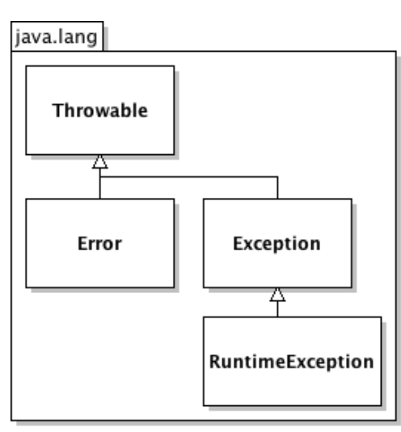

# Lecture 8

## Error Handling (Gestion des erreurs)

When an error occurs, Java creates an Exception object containing information about the error. The exception propagates up through the method call stack to the main() method (this is called exception propagation).

## Types of Errors

- **Severe errors**: Handled by objects of the `Error` class (not mentioned in your original notes but important to distinguish)
- **Programmer-handled errors**: Objects of the `Exception` class
- **Language-related errors**: Objects of the `RuntimeException` class (a subclass of `Exception`)

All exception classes are subclasses of the `Throwable` class.



## Exception Propagation

### Classic Propagation

When an error occurs, a `Throwable` object is created and propagates back through the call stack to the main() method.

### `try-catch` Blocks

This structure stops the propagation:

```java
try {
    // Code that might throw an exception
} 
catch (Exception ex) {
    // Exception handling code
    System.out.println("Error: " + ex);
}
```

### Selective Exception Handling

```java
try {
    // ...
}
catch (IndexOutOfBoundsException ex) {
    // Handle array/index errors
}
catch (ArithmeticException ex) {
    // Handle math errors
}
catch (Exception ex) {
    // Handle all other exceptions
}
```

The first matching catch block is executed. Order matters because of inheritance (more specific exceptions should come first).

### `finally` Block

Code that always executes, whether an exception occurs or not:

```java
try {
    // Open file
    // Read and process file
}
catch (IOException ex) {
    // Handle I/O errors
}
catch (Exception ex) {
    // Handle other errors
}
finally {
    // Close file (always executed)
}
```

## Exception Use Cases

### Displaying the Stack Trace

```java
try {
    // ...
}
catch (Exception ex) {
    ex.printStackTrace(); // Prints the call stack
}
```

### Throwing an Exception

```java
public String computeFullName(String firstName, String lastName) {
    if (firstName == null || firstName.isEmpty()) {
        throw new IllegalArgumentException("First name is invalid");
    }
    if (lastName == null || lastName.isEmpty()) {
        throw new IllegalArgumentException("Last name is invalid");
    }
    return firstName + " " + lastName;
}
```

### Checked Exceptions

All exceptions except `RuntimeException` are checked exceptions. Methods that can throw them must declare this:

```java
public String computeFullName(String firstName, String lastName) throws Exception {
    // ...
}
```

### Custom Exceptions

```java
public String computeFullName(String firstName, String lastName)
    throws InvalidFirstNameException, InvalidLastNameException {
    
    if (firstName == null || firstName.isEmpty()) {
        throw new InvalidFirstNameException(firstName);
    }
    if (lastName == null || lastName.isEmpty()) {
        throw new InvalidLastNameException(lastName);
    }
    return firstName + " " + lastName;
}
```